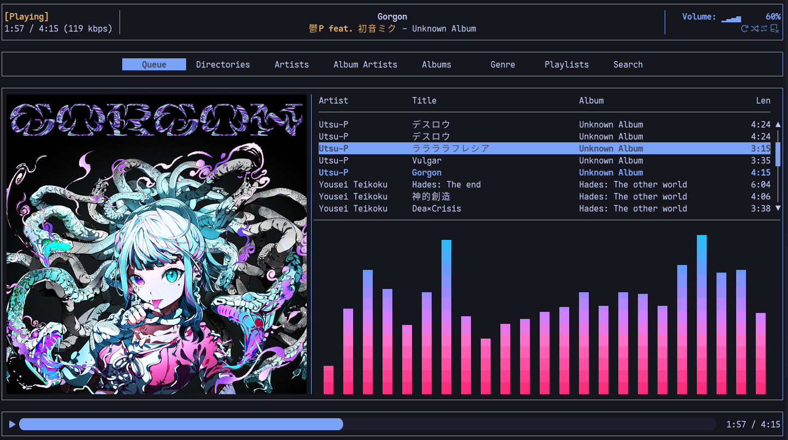

# Rusty Music Player Client

Rmpc is a beautiful, modern and configurable terminal based Music Player Daemon client. It is
heavily inspired by [ncmpcpp](https://github.com/ncmpcpp/ncmpcpp) and
[ranger](https://github.com/ranger/ranger)/[lf](https://github.com/gokcehan/lf) file managers.

## Get started

Description, configuration and installation methods can be found on [the rmpc website](https://rmpc.mierak.dev)

## Main Features

- Album cover art display if your terminal supports either of Kitty, Sixel, Iterm2 protocols, or via ueberzuggpp
- Cava integration for music visualisation
- Support for [synchronized lyrics](https://en.wikipedia.org/wiki/LRC_(file_format))
- Ability to play music from YouTube
- Configurable (T)UI
  - Configure what information(if any!) is displayed in the header
  - Configure what columns are displayed on the queue screen
  - Create any color theme you want
  - Every keybind can be changed, vim-like by default
- Ranger/LF-like three-column browser through your music library
- Basic playlist management
- Support scripting through basic CLI mode and script hooks

And more to come

## Discussion

* Open a discussion in the [repository](https://github.com/mierak/rmpc/discussions)
* Join the Discord server: https://discord.gg/9MAddPFqSF

## Status

Rmpc is still maturing. It is stable for daily use, although breaking changes, while rare, are sometimes unavoidable.

## Star History

<a href="https://www.star-history.com/#mierak/rmpc&type=date&legend=top-left">
 <picture>
   <source media="(prefers-color-scheme: dark)" srcset="https://api.star-history.com/svg?repos=mierak/rmpc&type=date&theme=dark&legend=top-left" />
   <source media="(prefers-color-scheme: light)" srcset="https://api.star-history.com/svg?repos=mierak/rmpc&type=date&legend=top-left" />
   
 </picture>
</a>

## Packaging status

